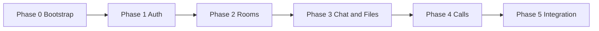

# 001 — MVP Implementation Plan

## Objective

Реализовать MVP платформы MOznoDS: групповые голосовые звонки (WebRTC P2P), текстовый чат с вложениями (картинки и файлы), управление комнатами и аутентификация пользователей.

## Phases Overview

| Phase | Name | Content | Owner |
|-------|------|---------|--------|
| 0 | Bootstrap | Django 5.1 project, config, core, requirements, optional Docker dev | Senior |
| 1 | Auth | accounts app, User/Profile, register, login (Token), permissions | Junior + Senior review |
| 2 | Rooms | rooms app, Room, RoomParticipant, CRUD + join/leave API | Junior |
| 3 | Chat + Files | files app (upload, storage), chat app (Message, attachments), REST + WebSocket for chat | Junior (REST), Senior (Channels) |
| 4 | Calls | calls app, WebRTC signaling (Channels), call state (Redis) | Senior |
| 5 | Integration | Permissions, pagination, tests, docs update | All |

---

## Phase 0 — Bootstrap

- [x] Create Django 5.1 project (`config/`, `manage.py`).
- [x] Split settings: `config/settings/base.py`, `local.py`, `production.py`.
- [x] Add `core/`: `TimestampedModel`, `exceptions.py`, `permissions.py`, `utils.py`.
- [x] Add `requirements/base.txt`, `local.txt`, `production.txt` (Django, DRF, Channels, PostgreSQL, Redis, Celery).
- [x] Optional: `docker-compose.yml` for PostgreSQL, Redis, MinIO (dev).
- [x] Configure ruff, pytest, pre-commit.

**Documentation updates:** `docs/tech.md` (versions), `docs/structure.md` (paths).

---

## Phase 1 — Authentication

- [x] Create `apps/accounts/`: custom User or extended profile, Profile model.
- [x] Token authentication (DRF TokenAuthentication or JWT); endpoints: register, login, logout, me.
- [x] Permissions: IsAuthenticated for protected endpoints.
- [x] UserService for registration logic; thin views.

**Documentation updates:** `docs/api.md` (auth endpoints).

---

## Phase 2 — Rooms

- [x] Create `apps/rooms/`: models Room, RoomParticipant (and optionally RoomInvite).
- [x] RoomService: create_room, add_participant, remove_participant.
- [x] REST: list (user's rooms), create, retrieve, update, delete; join, leave; list participants.
- [x] Permissions: only participants (or owner) for sensitive actions.

**Documentation updates:** `docs/api.md` (rooms endpoints), `docs/structure.md` (models).

---

## Phase 3 — Files and Chat

- [ ] Create `apps/files/`: File model, upload API, storage backend (local or S3-compatible).
- [ ] Create `apps/chat/`: Message, MessageAttachment; MessageService; REST list/send messages with optional file_ids.
- [ ] WebSocket consumer for chat: broadcast new messages to room channel (Senior).
- [ ] Permissions: only room participants can read/send messages and upload files to room context.

**Documentation updates:** `docs/api.md` (messages, files, WebSocket chat), `docs/structure.md`.

---

## Phase 4 — Voice Calls

- [ ] Create `apps/calls/`: Call, CallParticipant models (optional for MVP if state is only in Redis).
- [ ] SignalingConsumer (Channels): handle join_call, leave_call, offer, answer, ice_candidate; relay to target user(s) in room.
- [ ] ASGI routing: WebSocket URL for room (e.g. `/ws/room/<room_id>/`).
- [ ] Optional: call state in Redis for presence/UI (idle, connecting, active, ended).

**Documentation updates:** `docs/api.md` (WebSocket signaling), `docs/webrtc.md`.

---

## Phase 5 — Integration

- [ ] Review and fix permissions across all apps.
- [ ] Pagination for list endpoints (rooms, messages).
- [ ] Test coverage: models, services, views (and critical paths for consumers).
- [ ] Update docs: structure, API, tech, testing.

**Documentation updates:** `docs/structure.md`, `docs/api.md`, `docs/testing.md` as needed.

---

## Risks / Open Questions

- **P2P mesh scale:** MVP targets 4–5 participants per room; more users may require SFU later.
- **File size and type limits:** Define max file size (e.g. 10 MB) and allowed MIME types; document in API.
- **TURN/STUN:** For production, TURN server (e.g. coturn) is required for NAT traversal; document in `docs/webrtc.md`.
- **Storage:** MVP can use local storage; S3/MinIO for production should be configurable via settings.

---

## Documentation Updates (Summary)

| Phase | Files to update |
|-------|-----------------|
| 0 | `docs/tech.md`, `docs/structure.md` |
| 1 | `docs/api.md` |
| 2 | `docs/api.md`, `docs/structure.md` |
| 3 | `docs/api.md`, `docs/structure.md` |
| 4 | `docs/api.md`, `docs/webrtc.md` |
| 5 | `docs/structure.md`, `docs/api.md`, `docs/testing.md` |

---

## Rollback Strategy

- **Migrations:** Keep migrations reversible; if a phase is rolled back, run `migrate <app> <previous_migration_name>` and remove new migration files.
- **Feature flags:** Optional: wrap new features (e.g. WebSocket chat, calls) in settings flags so they can be disabled without code revert.
- **Git:** Each phase should be deliverable in one or more small commits; revert by commit range if needed.
- **Database:** Backup DB before running migrations in staging/production; restore from backup if rollback fails.

---

## Related Task Lists

- [tasks-senior.md](tasks-senior.md) — Senior Backend tasks
- [tasks-junior.md](tasks-junior.md) — Junior Python tasks
- [tasks-middle-ai.md](tasks-middle-ai.md) — Middle AI developer tasks
